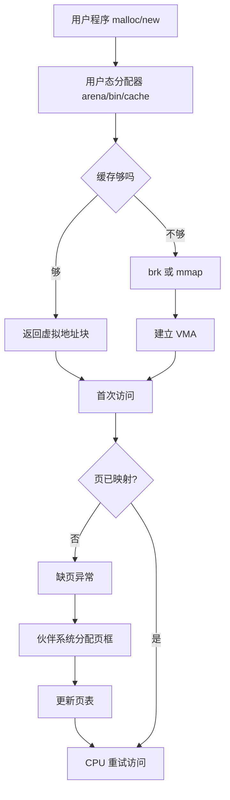

# 核心笔记：操作系统内存分配与分类

## 一句话解释

- 操作系统内存管理的本质，是在“地址空间隔离、性能、碎片、回收成本”之间，协调虚拟地址、物理页框和不同粒度对象的分配与回收。

## 五分钟解释

- 面试里讲“内存分配”，不能只讲 C 语言的堆和栈，要分三层：
- 进程地址空间长什么样。
- 虚拟内存如何按页映射到物理内存。
- 内核和用户态分别如何在不同粒度上分配。
- 进程看到的内存通常是虚拟连续的，但底层物理页可以离散。CPU 访问虚拟地址时，依赖页表完成转换；若页不存在或权限不对，会触发缺页异常。
- 用户程序 `malloc` 拿到的常常先只是用户态分配器管理的一块虚拟内存或缓存；真正物理页往往在首次访问时通过缺页异常按需建立。
- 内核层面，大块页框通常由伙伴系统管理，小对象通常由 slab/slub 管理。前者解决“页怎么拿”，后者解决“内核对象怎么高效复用”。
- 面试中的“内存分类”至少要从两个维度回答：
- 进程布局：代码段、数据段、BSS、堆、栈、共享库、内存映射区。
- 内核/系统视角：匿名页、文件页、页缓存、内核栈、slab 对象、高阶页、NUMA 本地页。

## 第一性原理模型

- 目标 1：隔离。不同进程不能互相乱读写。
- 目标 2：抽象。给进程一个“我有一整片连续地址空间”的错觉。
- 目标 3：效率。小对象不能总向系统要页，大对象不能总被小块碎片拖垮。
- 目标 4：可回收。空闲页、页缓存、匿名页、swap 都要能参与回收策略。
- 目标 5：局部性。尽量让数据留在 cache/TLB/本地 NUMA 节点。

## 关键机制

- 地址转换：虚拟地址经过页表转换到物理地址。
- 延迟分配：申请地址空间与实际分配物理页可分离。
- 伙伴系统：以 `2^k` 页为单位拆分与合并，管理空闲物理页框。
- slab/slub：把页切成固定大小对象缓存，减少小对象分配开销。
- 页缓存：缓存文件页，减少磁盘 IO。
- 换页/回收：内存压力下回收冷页、回写脏页、必要时触发 OOM。

## 例子

- 例 1：`malloc(64)` 通常不会每次都陷入内核，而是从用户态分配器的小块缓存拿。
- 例 2：`malloc(1GB)` 常见实现更可能直接用 `mmap`，因为便于单独映射和回收。
- 例 3：程序 `mmap` 一个文件后顺序读取，访问到尚未在页缓存中的页会触发缺页，内核读盘并建立映射。
- 例 4：内核频繁创建 `task_struct`、`dentry` 这类固定大小对象，更适合 slab/slub。

## 反例

- “堆就是一块连续物理内存。”错。通常只是虚拟地址上连续。
- “free 之后内存一定立刻还给操作系统。”错。常常先回到分配器。
- “虚拟内存就是 swap。”错。虚拟内存的核心是地址空间抽象与页式映射，swap 只是回收策略的一部分。
- “内存不够就是总量不够。”错。也可能是碎片、zone、NUMA、本地节点、高阶页、cgroup 限制问题。

## Mermaid 图

## 本轮新增

- 面试答题顺序模板：
- 先按“进程布局”回答分类。
- 再按“虚拟内存 + 页表 + 缺页”回答分配机制。
- 再补“伙伴系统 + slab/slub + malloc”回答不同粒度的分配器。
- 最后用“碎片、page fault、swap、NUMA、OOM”回答边界和生产问题。

### 2026-04-24 首轮诊断后补强

#### 1. 虚拟内存的标准定义

- 虚拟内存的核心不是“扩大物理内存”，那只是副作用之一，而且常被误解成 swap。
- 更准确地说，虚拟内存是操作系统给每个进程提供的一套虚拟地址空间抽象。
- 这套抽象主要解决四件事：
- 进程隔离：每个进程有自己的地址空间，不能直接乱访问别的进程。
- 地址连续假象：让进程看到连续地址，而底层物理页可以离散。
- 按需分配：先给地址范围，真正访问时再分配物理页。
- 共享与保护：不同进程可共享代码页/共享内存，但权限可控。
- 它不解决“物理内存永远不够”的问题。物理内存不足时，性能通常会急剧下降，尤其发生 major page fault 或 swap 时。
- 面试里不要说“虚拟内存本质是资源不足的妥协”，这太窄。更本质的是“抽象 + 隔离 + 复用 + 延迟分配”。

#### 2. `malloc` 和真正拿到物理页不是一回事

- 很多时候，`malloc` 只是让用户态分配器返回一段可用虚拟地址范围。
- 对于小块分配，用户态分配器可能直接从自己的缓存里切一块返回，甚至不需要立刻陷入内核。
- 当分配器不够用了，它才可能通过 `brk` 或 `mmap` 向内核申请新的虚拟内存区间。
- 这一步通常也不等于立刻分配物理页。
- 真正写这块地址时，如果页表里还没有合法映射，就触发缺页异常：
- CPU 发现该虚拟页没有映射。
- 陷入内核缺页处理程序。
- 内核检查访问是否合法。
- 若合法，则分配物理页框、清零、更新页表。
- 返回用户态，CPU 重试原指令。
- 所以“申请内存”和“得到物理页”是两阶段。

#### 3. 伙伴系统和 slab/slub 的职责边界

- 伙伴系统管理的是“页框”，也就是以页为单位甚至 `2^k` 页为单位的物理内存块。
- 它擅长回答：我要 1 页、2 页、4 页、8 页，哪里有空闲块？
- slab/slub 管理的是“小对象缓存”。
- 它擅长回答：我要一个 `task_struct`、`dentry`、`inode` 这种固定大小对象，如何快速拿到、快速复用？
- 二者关系是：
- slab/slub 底层通常仍向伙伴系统申请页。
- 然后 slab/slub 再把页切成很多固定大小对象。
- 如果小对象每次都直接找伙伴系统拿整页，开销大、浪费大、碎片也会更严重。

#### 4. 碎片必须分内部和外部

- 内部碎片：你已经分到一块内存，但用不满。
- 例子：请求 33B，分配器按 64B 桶给你，剩下那部分浪费在块内部。
- 外部碎片：总空闲量看起来够，但碎成很多小块，拼不出你要的连续大块。
- 例子：系统还有很多零散空闲页，但拿不到连续 8 页的高阶块。
- 面试里经常追问：为什么“还有空闲内存”却高阶分配失败？答案就是外部碎片是核心嫌疑之一。

#### 5. 进程内存分区里你答得对和不对的点

- 对的部分：
- 你知道代码段、数据段、BSS、堆、栈、mmap 区的大致职责。
- 你知道 `mmap` 区常放共享库、文件映射和大块匿名内存。
- 需要修正的部分：
- 代码段不是“汇编代码”这个说法的重点，而是机器指令与只读代码/只读数据映射。
- BSS 放的是“未显式初始化的全局/静态变量”，不是“编译器初始化的常量”。
- 常量通常不会放在 BSS，往往在只读数据区。
- 返回值并不一定“放在栈上”，它依赖调用约定，很多情况下会经寄存器返回。

#### 6. 面试里的标准答题框架

- 如果面试官问“内存分类”，先分两层答：
- 进程视角：代码段、数据段、BSS、堆、栈、mmap 区。
- 系统视角：匿名页、文件页、页缓存、内核对象、页框、NUMA 节点。
- 如果面试官问“内存分配”，按这条线答：
- 用户态分配器 `malloc/new`
- 不够时 `brk/mmap`
- 建立虚拟地址区间
- 首次访问触发缺页异常
- 内核分配物理页并更新页表
- 小对象靠缓存，大块页靠伙伴系统

### 2026-04-24 第一次复测纠偏

#### 7. 缺页异常不是“虚拟内存不足”

- 你现在最大的误区是把缺页异常理解成“虚拟内存不够了，所以去申请”。
- 这不准确。
- 缺页异常的直接触发条件是：
- CPU 访问了一个当前页表里没有有效映射的虚拟页。
- 或者访问权限不满足，比如写只读页。
- 常见场景：
- 新申请的匿名页第一次被写入，还没映射物理页。
- 访问了被换出的页，需要重新载入。
- 访问了 `mmap` 文件中尚未装入内存的页。
- 访问了非法地址，最终会变成段错误。
- 所以“缺页”描述的是“当前访问对应的页不在可直接访问状态”，不是“虚拟内存空间不够”。

#### 8. 向内核申请的通常不是“连续物理内存首尾地址”

- 在现代虚拟内存系统里，用户态 `malloc` 向内核要的常常是：
- 一段新的虚拟地址区间
- 或者扩展现有堆区
- 而不是“请给我一段连续物理内存的起止地址”
- 对用户进程来说，更重要的是虚拟地址连续。
- 底层物理页完全可以是离散的。
- 只有某些特殊需求才强调连续物理内存，比如 DMA、大页、特定内核场景。

#### 9. 伙伴系统详细讲解

- 伙伴系统是 Linux 内核管理空闲物理页框的经典方法。
- 它管理的是“按 2 的幂次组织的连续页块”。
- 如果页大小是 4KB，那么：
- order 0 = 1 页 = 4KB
- order 1 = 2 页 = 8KB
- order 2 = 4 页 = 16KB
- order 3 = 8 页 = 32KB
- 以此类推

- 为什么这样设计：
- 拆分容易：大块可以一分为二，直到得到目标大小。
- 合并容易：如果两个相邻的同阶空闲块正好互为伙伴，就能合并回更大块。
- 管理简单：空闲链表按阶组织，查找和回收逻辑清晰。

- 分配过程：
- 假设要 1 页，也就是 order 0。
- 如果 order 0 空闲链表里没有。
- 就去 order 1 找；还没有就去 order 2、order 3 往上找。
- 找到一个更大的空闲块后，持续对半拆分。
- 每拆一次，把另一半挂回对应阶的空闲链表。
- 最终得到所需大小的块。

- 释放过程：
- 释放一个 order k 的块时，内核会找它的“伙伴块”。
- 如果伙伴块也空闲、而且阶数相同，就把两者合并成一个 order k+1 的大块。
- 然后继续向上尝试合并。
- 这就是为什么它叫“伙伴”系统。

- 面试里最重要的一句话：
- 伙伴系统解决的是“页框级别连续块怎么高效拆分与合并”。
- 它不适合频繁处理大量小对象，因为整页粒度太粗。

#### 10. 用一个例子理解伙伴系统

- 假设系统当前有一个 order 3 的空闲块，也就是 8 页。
- 现在我要 1 页。
- 内核把 8 页拆成两个 4 页块。
- 取其中一个 4 页块，再拆成两个 2 页块。
- 再取其中一个 2 页块，拆成两个 1 页块。
- 拿走其中 1 页给你。
- 另外那几个“另一半”分别挂回 order 2、order 1、order 0 的空闲链表。
- 以后释放这 1 页时，如果它对应的那半页块伙伴也空闲，就先合并成 2 页，再继续看能否合成 4 页、8 页。

#### 11. 重新修正内部碎片和外部碎片

- 你现在的方向有一点接近，但还不够准。
- 内部碎片不等于“虚拟内存没用满”。
- 更精确定义是：已经分配给你的块内部，存在你用不到的浪费空间。
- 例子：请求 50B，分配器按 64B 桶分配，多出来的 14B 就是内部碎片。
- 外部碎片也不只是“物理内存分配不合理”。
- 更精确定义是：空闲内存被切成很多小块，虽然总量够，但无法满足大的连续请求。
- 例子：总共有 64KB 空闲，但分散成很多 4KB 小洞，于是拿不到连续 32KB。

#### 12. 你现在的正确版本应该怎么说

- 虚拟内存：
- “虚拟内存是操作系统为每个进程提供的独立地址空间抽象，通过页表把虚拟地址映射到物理页。它主要解决隔离、地址连续假象、按需分配和共享保护，不等同于 swap，也不是单纯为了扩大物理内存。”

- `malloc` 链路：
- “`malloc` 先向用户态分配器要内存，小块常从缓存中切；不足时通过 `brk` 或 `mmap` 向内核申请新的虚拟地址区间。第一次真正访问某个尚未映射的页时，触发缺页异常，内核分配物理页并更新页表，然后 CPU 重试指令。”

- 伙伴系统：
- “伙伴系统以 `2^k` 页为单位管理空闲物理页块，分配时从更大块拆分，释放时与空闲伙伴合并，适合页级分配，不适合大量小对象。”

### 2026-04-24 冲刺补强：slab/slub、碎片、排障

#### 13. slab/slub 到底解决什么问题

- 伙伴系统管理页框，粒度至少是页。
- 但内核里有大量“小而固定大小”的对象会被频繁创建和销毁，比如：
- `task_struct`
- `dentry`
- `inode`
- 各种协议栈对象
- 如果这些对象每次都直接向伙伴系统申请整页：
- 开销大
- 浪费大
- 容易把页级分配路径打爆

- slab/slub 的核心思路：
- 先从伙伴系统拿若干页
- 再把页切成很多固定大小对象
- 维护对象缓存，已初始化过的对象可以复用

- 一句话边界：
- 伙伴系统解决“页怎么分”
- slab/slub 解决“内核小对象怎么高效分”

#### 14. slab 和 slub 不需要背实现细节，但要会答职责

- 面试里通常不要求你深挖 slab 和 slub 内部实现差异。
- 你至少要答出：
- 它们都是内核对象分配器
- 底层向伙伴系统拿页
- 再把页切成固定大小对象缓存
- 目的是降低频繁小对象分配释放的成本，并减少碎片

- 安全答法：
- “Linux 内核里页级分配主要靠伙伴系统；大量固定大小小对象通常由 slab/slub 这类对象缓存分配器管理。它们底层仍用伙伴系统拿页，但对上提供更适合小对象复用的分配方式。”

#### 15. 内部碎片 vs 外部碎片，最终可背版

- 内部碎片：
- 分给你的块比你实际需求大，浪费发生在块内部
- 常见于按桶、按固定规格分配
- 例子：申请 33B，分配器给你 64B

- 外部碎片：
- 空闲总量够，但空闲空间被切碎，无法满足更大的连续请求
- 常见于需要连续空间或高阶页时
- 例子：系统还有很多空闲页，但拿不到连续 8 页

- 面试强信号：
- “内部碎片关注分配块内部浪费，外部碎片关注空闲空间不能有效拼接。”

#### 16. 线上排障最常见的几个指标

- `RSS`
- Resident Set Size
- 进程当前实际驻留在物理内存中的页

- `VSZ`
- Virtual Memory Size
- 进程占用的虚拟地址空间大小
- 大不代表真的占了那么多物理内存

- `PSS`
- Proportional Set Size
- 共享页按比例分摊后算到进程头上的内存
- 比 RSS 更适合估算共享库很多时的真实占用

#### 17. 线上排障常用命令怎么用

- `vmstat`
- 看系统级内存压力、swap、缺页、运行队列
- 如果 `si/so` 明显上升，说明有 swap in/out

- `/proc/<pid>/smaps`
- 看进程每个映射区的详细内存组成
- 能看匿名页、文件页、共享、私有、脏页等

- `slabtop`
- 看内核 slab/slub 对象缓存占用
- 适合判断是否更像内核对象缓存膨胀，而不是用户态堆问题

#### 18. 三类常见面试场景怎么区分

- 场景 1：用户态堆膨胀或泄漏
- 现象：某进程 RSS 持续涨，`smaps` 中匿名内存增长明显

- 场景 2：页缓存大
- 现象：系统已用内存高，但不是某个进程 RSS 特别高
- 文件缓存大，通常内核可回收

- 场景 3：内核对象缓存异常
- 现象：用户进程看起来没那么大，但系统内存仍紧张
- `slabtop` 某类对象异常增长

#### 19. 这一轮你必须会的压缩答案

- slab/slub：
- “slab/slub 是内核的小对象分配器，底层向伙伴系统拿页，再把页切成固定大小对象缓存，用来降低小对象频繁分配释放的成本。”

- 内部/外部碎片：
- “内部碎片是已分配块内部的浪费；外部碎片是空闲空间虽然总量够但过于零散，无法满足更大的连续请求。”

- 排障：
- “看进程占用先区分 VSZ、RSS、PSS；看系统是否 swap 和缺页可用 vmstat；看具体映射区用 smaps；怀疑内核对象缓存异常就看 slabtop。”

### 2026-04-24 排障专项纠偏

#### 20. 面试里怎么答“Linux 内存紧张怎么定位”

- 不要一上来就说“看 swap 够不够”。
- 面试官要的是分层排障路径：
- 先看系统级
- 再看进程级
- 再看内核对象级

- 标准答题模板：
- 第一步，用 `vmstat` 看系统是否有明显内存压力、缺页和 swap in/out。
- 第二步，看进程的 `RSS/VSZ/PSS`，判断是不是某个进程真实驻留内存过高。
- 第三步，用 `/proc/<pid>/smaps` 看具体是哪类映射涨了：匿名页、文件映射、共享库还是别的区域。
- 第四步，如果用户进程看起来不高，但系统仍然吃紧，用 `slabtop` 看是否是内核 slab 对象缓存异常增长。

#### 21. 三类问题的区分模板

- 某个进程匿名内存膨胀：
- 现象：某进程 `RSS` 持续高，`smaps` 里匿名内存增长明显。
- 结论：更像用户态堆、匿名映射、泄漏或分配器缓存膨胀。

- 页缓存过大：
- 现象：系统已用内存高，但未必有单个进程 `RSS` 特别夸张。
- `vmstat` 可辅助看回收压力，`smaps` 往往不表现为某个进程匿名内存暴涨。
- 结论：更像文件页缓存占用大，通常可回收。

- 内核 slab 对象异常增长：
- 现象：用户进程看起来不算特别大，但机器依然内存紧张。
- `slabtop` 某一类对象缓存持续膨胀。
- 结论：更像内核对象或内核缓存问题，而不是用户态堆问题。

#### 22. 这道排障题的安全高分答法

- “我会先用 `vmstat` 看系统是否存在明显的内存压力、swap in/out 和缺页情况，再看各进程的 `RSS`、`VSZ`、`PSS` 判断是不是某个进程真实占用过高。若怀疑是某个进程，我会继续看 `/proc/<pid>/smaps`，区分增长的是匿名内存还是文件映射；如果用户进程都不高但系统仍紧张，我会用 `slabtop` 判断是否是内核 slab 对象缓存异常增长。这样可以把问题区分成匿名内存膨胀、页缓存过大或内核对象异常三类。” 

#### 23. 碎片定义最后再收一次

- 内部碎片：
- 已分配块内部的浪费
- 外部碎片：
- 空闲空间总量够，但无法满足更大连续请求

- 不要再把它表述成“虚拟内存碎片”和“真实物理内存碎片”。
- 面试官要的是分配视角，不是地址命名视角。

### 2026-04-24 17:29

新增首轮诊断后补强：虚拟内存标准定义、malloc 与缺页异常链路、伙伴系统/slab/slub 边界、内部/外部碎片、面试标准答题框架。

### 2026-04-24 17:53

新增第一次复测纠偏：缺页异常触发条件、向内核申请通常是虚拟地址区间、伙伴系统 order 拆分与伙伴合并、内部/外部碎片精确定义。

### 2026-04-24 21:36

短复测进步明显：用户已掌握缺页和按需分配的核心链路。需继续修正虚拟内存标准定义，以及伙伴系统的按阶空闲链表与局部拆分/合并机制。

### 2026-04-24 22:37

最终压缩复测通过了三条主链：虚拟内存定义、malloc 到缺页映射、伙伴系统基本机制。残留短板主要在更完整的内存分类体系、slab/slub、碎片与生产排障。

### 2026-04-24 22:55

新增冲刺补强：slab/slub 是内核小对象分配器；内部碎片与外部碎片的最终可背版本；vmstat/smaps/slabtop 和 RSS/VSZ/PSS 的最小排障框架。

### 2026-04-24 23:09

本轮暴露的核心问题集中在面试排障题：缺少指标、命令、现象与结论的对应关系。

### 2026-04-25 00:19

最终专项复测通过，补齐了从概念到排障的最小面试闭环。当前已达到普通到中强度操作系统内存面试可接受水平。
