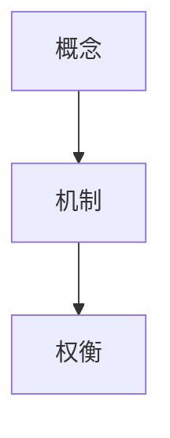

# 核心笔记：虚拟内存

## 一句话解释

## 五分钟解释

## 第一性原理模型

## 关键机制

## 例子

## 反例

## Mermaid 图



## 本轮新增

### TLB 命中后谁计算物理地址

CPU 执行 load/store 指令时，先由执行单元/地址生成单元根据寄存器、立即数、寻址模式计算出虚拟地址。虚拟地址被拆成虚拟页号 VPN 和页内偏移 offset。

TLB 命中时，TLB 返回对应的物理页框号 PFN 以及权限/属性信息。硬件在命中路径上检查访问权限；通过后，由 MMU/负载存储单元所在的地址翻译硬件把 `PFN + offset` 组合成最终物理地址。这个过程不需要内核参与。

关键边界：

- 进程发出的是虚拟地址，不是物理地址。
- TLB 命中返回的是页级翻译结果：`VPN -> PFN + 权限/属性`。
- 页内偏移来自原虚拟地址的低位，翻译前后保持不变。
- 最终物理地址由硬件生成，不是用户态计算，也不是内核逐次计算。

```text
虚拟地址 = VPN + offset
TLB 命中：VPN -> PFN + 权限
物理地址 = PFN + offset
```

### 虚拟内存后续学习主线

1. `VMA -> PTE -> PFN`：区分虚拟内存区域、页表项、物理页框。
2. page fault 路径：合法缺页、权限异常、COW、SIGSEGV 的分流。
3. mmap/file/page cache/swap：文件映射和匿名页如何落到物理内存。
4. TLB 性能：TLB miss、flush、shootdown、ASID/PCID、大页。
5. 进程内存观测：`/proc/<pid>/maps`、`smaps`、`vmstat`、`perf`。
6. 生产问题：内存泄漏、RSS/VSS 差异、OOM、overcommit、major fault 抖动。
