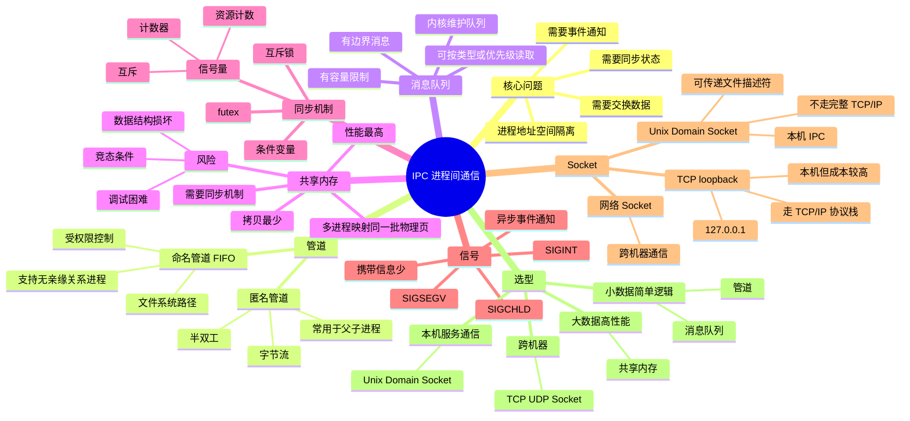

# 进程间通信 IPC

> IPC（Inter-Process Communication）解决的是：不同进程拥有独立地址空间，不能像线程那样直接访问彼此变量，因此需要借助内核或共享映射来交换数据、同步状态、通知事件。

## 1. 常见 IPC 方式总览

| 方式 | 数据形态 | 主要用途 | 优点 | 缺点 |
| --- | --- | --- | --- | --- |
| 匿名管道 | 字节流 | 父子进程、shell 管道 | 简单、天然 FIFO | 单向、通常要求亲缘关系 |
| 命名管道 FIFO | 字节流 | 同一机器上无亲缘关系进程通信 | 有文件系统路径，使用方便 | 仍是字节流，表达能力有限 |
| 消息队列 | 有边界的消息 | 结构化消息传递 | 保留消息边界，可按类型读取 | 内核维护，有容量限制和拷贝开销 |
| 共享内存 | 共享内存区域 | 大数据量、高性能通信 | 数据拷贝最少，速度快 | 本身不提供同步，容易出现竞态条件 |
| 信号量 | 计数器 / 同步原语 | 同步、互斥、资源计数 | 可配合共享内存控制并发访问 | 只解决同步，不传递业务数据 |
| 信号 | 异步事件通知 | 中断、终止、异常通知 | 轻量、异步 | 携带信息少，处理逻辑受限制 |
| Socket | 字节流或数据报 | 本机或跨机器通信 | 通用、可跨网络 | 协议栈和拷贝成本更高 |
| Unix Domain Socket | 字节流或数据报 | 同一机器 IPC | 比 TCP loopback 更轻，支持传递 fd | 只能本机使用 |

## 2. 管道

### 2.1 匿名管道

匿名管道是半双工通信机制，数据以字节流形式存放在内核缓冲区中。

特点：

- 通常用于具有亲缘关系的进程，比如父子进程。
- 只能单向传输；如果要双向通信，一般需要两个管道。
- 没有消息边界，读端看到的是连续字节流。
- 生命周期通常跟随相关文件描述符；读写端都关闭后，管道资源被释放。

典型例子：

```bash
cat file.txt | grep keyword
```

这里 shell 会创建管道，把 `cat` 的标准输出接到 `grep` 的标准输入。

### 2.2 命名管道 FIFO

命名管道在文件系统中有一个路径名，非亲缘关系进程也可以通过这个路径打开它进行通信。

需要注意：

- 不是“所有进程都能用”，还要受文件权限、命名空间、进程权限控制。
- 它仍然是管道，本质仍是内核缓冲区中的字节流。
- 它适合本机 IPC，不适合跨机器通信。

## 3. 消息队列

消息队列是由内核维护的消息链表或队列。相比管道，消息队列传递的是有边界的消息，而不是无边界字节流。

特点：

- 每条消息有明确边界。
- 可以携带类型或优先级等元信息。
- 接收方可以按类型或优先级选择消息。
- 内核负责排队、缓冲和唤醒等待进程。

与管道相比：

| 对比项 | 管道 | 消息队列 |
| --- | --- | --- |
| 数据形态 | 字节流 | 有边界的消息 |
| 读取方式 | 通常 FIFO | 可按消息类型/优先级读取 |
| 表达能力 | 需要应用层自己拆包 | 天然保留消息边界 |
| 成本 | 简单但仍有内核拷贝 | 更灵活，但内核管理成本更高 |

生命周期要区分实现：

- System V 消息队列通常具有内核持久性，显式删除或系统重启前可能一直存在。
- POSIX 消息队列也需要显式关闭/删除，具体生命周期受 API 和系统实现影响。
- 应用层消息队列，例如 Redis、Kafka、RabbitMQ，不属于操作系统内核 IPC 的同一层次。

## 4. 共享内存

共享内存是高频考点。它的核心思想是：

> 由内核把同一批物理页映射到多个进程各自的虚拟地址空间中。进程看到的虚拟地址可以不同，但背后可能指向同一批物理页。

不要说“进程直接拿到物理地址”。更准确地说：

```text
进程 A 虚拟地址 ----\
                   -> 同一批物理页
进程 B 虚拟地址 ----/
```

优点：

- 数据不需要在多个进程的用户态缓冲区之间来回复制。
- 适合大块数据、高频数据交换。
- 延迟低、吞吐高。

缺点：

- 共享内存只解决“共享数据”，不解决“谁先读、谁先写、写到一半怎么办”。
- 多个进程同时读写同一块内存会出现竞态条件。
- 通常必须配合信号量、互斥锁、条件变量、futex 等同步机制。

## 5. 信号量

信号量本质上是一个计数型同步原语，用来控制多个进程对共享资源的访问。

常见用途：

- 互斥：同一时刻只允许一个进程进入临界区。
- 计数：限制同时访问某资源的进程数量。
- 同步：一个进程等待另一个进程完成某个阶段。

共享内存经常配合信号量使用：共享内存负责传数据，信号量负责控制访问顺序。

## 6. 信号

信号是一种异步事件通知机制。它不是为了传输大量数据，而是为了告诉进程“某个事件发生了”。

例子：

- `Ctrl+C` 通常发送 `SIGINT`。
- 访问非法内存可能触发 `SIGSEGV`。
- 子进程退出会向父进程发送 `SIGCHLD`。
- `kill` 命令可以向进程发送指定信号。

注意：

- 信号携带的信息很少。
- 信号处理函数能做的事情有限，不能随意调用非异步信号安全函数。
- 信号适合通知，不适合作为复杂数据通信通道。

## 7. Socket 与 Unix Domain Socket

Socket 不只用于网络，也可以用于本机进程通信。

### 7.1 TCP loopback：`127.0.0.1`

两个本机进程通过 `127.0.0.1` 通信时，仍然走 TCP/IP 协议栈，只是数据不会真的经过网卡。

特点：

- 使用 TCP 语义，可靠、有序、字节流。
- 可复用网络编程模型。
- 成本高于专门的本地 IPC。

### 7.2 Unix Domain Socket

Unix Domain Socket（UDS）专门用于同一台机器上的进程通信。

特点：

- 不需要完整 TCP/IP 协议栈。
- 延迟通常低于 TCP loopback。
- 吞吐通常更高。
- 可以传递文件描述符，这是普通 TCP socket 做不到的。

不要把网络 Socket 和 WebSocket 混为一谈。WebSocket 是应用层协议，通常运行在 TCP 之上；而这里讨论的是操作系统提供的 socket IPC 机制。

## 8. 为什么共享内存最快

管道、消息队列、Socket 通常都需要经过内核缓冲区：

```text
发送进程用户态 buffer -> 内核 buffer -> 接收进程用户态 buffer
```

共享内存建立映射后，双方直接读写映射到各自地址空间中的同一批物理页：

```text
进程 A 虚拟地址 -> 共享物理页 <- 进程 B 虚拟地址
```

因此共享内存减少了数据拷贝开销，尤其适合大块数据传输。

但共享内存不是“无成本”：

- 建立映射需要系统调用。
- 第一次访问可能触发缺页异常。
- 同步仍然需要额外机制。
- 跨 CPU 核心读写还会受到缓存一致性、伪共享、内存屏障等影响。

## 9. 既然共享内存快，为什么还需要管道和消息队列

因为性能不是唯一目标。

共享内存的问题：

- 容易出现竞态条件。
- 需要自己设计同步协议。
- 数据结构损坏后很难恢复。
- 调试复杂。
- 安全边界更难设计。

管道和消息队列的优势：

- 内核帮助管理缓冲区。
- 数据流动方向更清晰。
- 不容易把共享数据结构写坏。
- 使用成本低，适合简单通信。

所以选型原则是：

> 数据量小、逻辑简单，优先管道/消息队列/Socket；数据量大、性能要求高，再考虑共享内存，并且必须同时设计同步机制。

## 10. IPC 选型速记

| 场景 | 推荐方式 | 原因 |
| --- | --- | --- |
| shell 命令串联 | 匿名管道 | 简单、天然适配标准输入输出 |
| 无亲缘关系进程本机简单通信 | 命名管道 / UDS | 有路径名，进程容易找到 |
| 结构化小消息 | 消息队列 | 保留消息边界 |
| 大块数据高速交换 | 共享内存 + 同步原语 | 减少数据拷贝 |
| 只做事件通知 | 信号 | 异步、轻量 |
| 本机服务通信 | Unix Domain Socket | 通用、性能好、支持 fd 传递 |
| 跨机器通信 | TCP/UDP Socket | 支持网络通信 |

## 11. 对原笔记的点评

这篇笔记抓住了 IPC 的主干：管道、消息队列、共享内存、信号量、信号、Socket 都覆盖到了，而且你知道共享内存快的核心原因是减少数据拷贝，这个方向是对的。

但原文有几处必须修正：

- “命名管道所有进程都能用”不严谨。它依赖文件路径和权限控制，不是任意进程都能访问。
- “多个进程的虚拟地址指向物理内存中同一块物理地址”容易误导。更准确是多个虚拟页映射到同一批物理页，用户态通常不直接接触物理地址。
- “信号是唯一的异步通信机制”说得太绝对。信号是典型异步通知机制，但很多 I/O 通知机制也可以异步工作。更稳妥的说法是：信号是 Unix 中典型的异步事件通知机制。
- “网络套接字（WebSocket）”概念混了。Socket 是操作系统抽象，WebSocket 是应用层协议。
- “管道和消息队列天然杜绝竞态条件”也太满。它们减少共享内存那种直接并发写同一数据结构的风险，但应用层协议仍可能有竞态、乱序理解、状态不一致等问题。

总体评价：这是一个不错的扫盲笔记，但原文停留在“知道有哪些 IPC”层面。下一步要从“分类记忆”升级到“机制比较”：数据在哪里、拷贝几次、谁负责同步、生命周期如何、失败模式是什么、适合什么场景。

## 12. 思维导图


