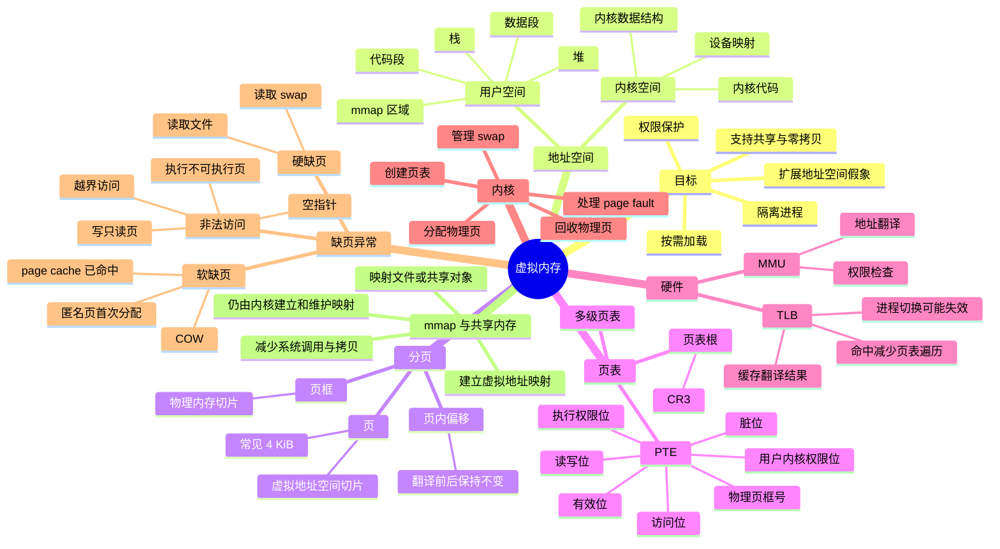

# 虚拟内存：页、页表、MMU、TLB 与缺页异常

> 核心问题：进程看到的是“连续、私有、巨大的虚拟地址空间”，机器真正拥有的是有限的物理内存。虚拟内存机制负责把二者连接起来，并用权限、隔离、按需加载和置换来管理这层幻象。

## 1. 先分清三个基本对象

| 概念 | 位于哪里 | 作用 | 关键点 |
| --- | --- | --- | --- |
| 页（page） | 虚拟地址空间 | 虚拟内存的固定大小切片 | 常见大小是 4 KiB，但不是所有系统都固定为 4 KiB，也可能有大页 |
| 页框（page frame） | 物理内存 | 物理内存的固定大小切片 | 大小通常与页一致，用来承载某个虚拟页的数据 |
| 页表（page table） | 物理内存中的内核管理数据结构 | 记录“虚拟页 -> 物理页框”的映射和权限 | 每个进程通常有自己的页表根，页表由内核创建和维护 |

进程看到的地址是虚拟地址。虚拟地址会被拆成两部分：

```text
虚拟地址 = 虚拟页号 VPN + 页内偏移 offset
```

地址翻译过程：

```text
虚拟页号 VPN -> 查页表 -> 物理页框号 PFN
物理页框号 PFN + 页内偏移 offset -> 物理地址
```

注意：页内偏移不会变。虚拟地址和物理地址的“页号部分”会变，页内偏移保持一致。

## 2. 页表项 PTE 到底记录什么

页表中的每一项叫 PTE（Page Table Entry，页表项）。PTE 通常不需要显式保存虚拟页号，因为普通多级页表是通过虚拟页号逐级索引到 PTE 的。PTE 更核心的是保存目标物理页框号和各种控制位。

常见控制位包括：

| 控制位 | 含义 | 作用 |
| --- | --- | --- |
| 有效位 / present bit | 当前虚拟页是否有有效映射 | 无效时访问会触发缺页异常 |
| 读写位 | 页面是否可写 | 保护代码段、只读映射、写时复制页面 |
| 用户 / 内核权限位 | 用户态是否允许访问 | 防止用户进程直接访问内核空间 |
| 执行权限位 | 页面是否允许执行指令 | 配合 NX/XD 防止把数据页当代码执行 |
| 脏位 dirty bit | 页面是否被修改过 | 页面换出时决定是否需要写回磁盘 |
| 访问位 accessed bit | 页面是否被访问过 | 页面置换算法会参考它 |

## 3. MMU：硬件负责翻译，内核负责规则

MMU（Memory Management Unit，内存管理单元）是 CPU 里的硬件单元，负责把虚拟地址翻译成物理地址，并检查访问权限。

要点：

- MMU 不是内核的一部分，它是硬件。
- 页表由内核创建和维护。
- 用户态代码不能随意修改页表。
- 用户态进程通常也拿不到“真实物理地址”；它只是发起对虚拟地址的读写，地址翻译由 CPU/MMU 自动完成。
- 如果访问违反 PTE 权限，硬件会触发异常，CPU 陷入内核态，由内核处理。

所以更准确的表述是：

> 用户态不能直接管理物理内存，也不能直接改页表。它只能访问自己虚拟地址空间中被允许访问的区域。物理内存的分配、回收、映射关系和权限控制，最终都由内核掌握。

## 4. TLB：页表查询的硬件缓存

如果每次内存访问都完整遍历多级页表，性能会非常差。因此 MMU 使用 TLB（Translation Lookaside Buffer，快表）缓存最近的地址翻译结果。

访问流程：

```text
CPU 发出虚拟地址
      |
      v
MMU 查 TLB
      |
      +-- TLB 命中：直接得到物理页框号
      |
      +-- TLB 未命中：硬件或内核执行页表遍历，找到 PTE 后回填 TLB
```

TLB 缓存的是“虚拟页号 -> 物理页框号 + 权限”等信息，而不是任意粒度的完整地址。最终地址仍然要拼上页内偏移。

## 5. mmap 和共享内存：不是绕过内核，而是减少后续系统调用

原文里“绕过内核态，直接对某块物理内存进行读写”这个说法容易误导。更准确的说法是：

> mmap、共享内存等机制需要内核先建立映射。映射建立后，用户态程序可以用普通 load/store 指令访问对应虚拟地址；只要页已经在内存中且 TLB 命中，读写路径不需要每次都执行系统调用。

mmap 的本质不是“把物理内存地址暴露给用户态”，而是把某段虚拟地址范围映射到某个对象：

- 普通文件
- 匿名内存
- 共享内存对象
- 设备内存
- page cache 中的页

两个进程可以把同一个共享对象映射到各自的虚拟地址空间中：

```text
进程 A 虚拟地址 0x7000_0000 ----\
                                 -> 同一批物理页 / 同一个共享对象
进程 B 虚拟地址 0x5000_0000 ----/
```

它们看到的虚拟地址可以不同，但背后指向同一批物理页。这样进程 A 写入后，进程 B 可以看到结果。不过这不意味着“没有内核参与”：建立映射、处理缺页、权限检查、回收页面、同步文件脏页，都仍然由内核负责。

## 6. 进程虚拟地址空间：用户空间与内核空间

一个进程的虚拟地址空间通常分为：

- 用户空间：进程私有，包括代码段、数据段、堆、栈、mmap 区域等。
- 内核空间：映射内核代码、内核数据结构、设备映射等，只允许内核态访问。

进程切换时，CPU 需要切换到新进程的页表根。在 x86 上，页表根地址通常放在 CR3 寄存器中。

但“只要切 CR3 就光速切换”说得过于轻松。更完整地说：

- 切换页表根会改变当前地址空间。
- TLB 可能需要刷新，或者依赖 ASID/PCID 减少刷新成本。
- 内核空间映射通常在多个进程页表中保持一致，但现代系统还可能因为 KPTI 等安全机制拆分用户态和内核态页表。
- 上下文切换还包括寄存器、调度状态、内核栈等内容，不只是页表切换。

## 7. 缺页异常：不是所有缺页都一样

“缺页中断”更严格地说通常叫 page fault，即缺页异常。它不是传统外设中断，而是 CPU 在执行当前指令时发现地址翻译失败或权限不满足而产生的同步异常。

### 7.1 软缺页 / minor page fault

数据不需要从磁盘读取，但当前页表还没有可用映射，内核处理后即可继续执行。

常见场景：

- 物理页已经在内存中，只是当前进程页表还没建立映射。
- 文件内容已经在 page cache 中。
- 匿名页第一次访问，需要分配零页或真实物理页。
- 写时复制（COW）触发，需要复制一个新页。

软缺页也有成本，只是通常远小于磁盘 I/O。

### 7.2 硬缺页 / major page fault

需要从磁盘或其他慢速存储读取数据。

常见场景：

- 程序代码或数据尚未加载到物理内存。
- 文件映射页不在 page cache 中。
- 页面曾被换出到 swap，需要从 swap 读回。

硬缺页代价很高，可能导致当前进程阻塞，等待 I/O 完成。

### 7.3 无效缺页 / 非法访问

访问了不允许访问的虚拟地址或违反权限。

典型例子：

- 解引用空指针。
- 访问未分配的虚拟地址。
- 用户态访问内核地址。
- 向只读页面写入。
- 执行不可执行页面中的数据。

结果通常是内核向进程发送 `SIGSEGV`，进程如果没有处理该信号就会崩溃，也就是常说的段错误。

## 8. 一句话串起来

虚拟内存让每个进程以为自己拥有独立、连续的地址空间；页表描述虚拟页到物理页框的映射；MMU 根据页表和 TLB 完成地址翻译与权限检查；缺页异常把“映射不存在、页面未加载、权限不满足”等情况交给内核处理；mmap 和共享内存通过建立映射减少后续数据拷贝和系统调用成本，但绝不是让用户态脱离内核直接掌控物理内存。

## 9. 对原笔记的评价

这篇笔记的优点是抓住了虚拟内存最重要的一条主线：进程看到虚拟地址，硬件通过页表翻译到物理内存，内核掌握分配和权限。这个方向是对的，而且你能把 MMU、TLB、mmap、共享内存和缺页异常放到同一张图里思考，说明不是在背孤立概念。

但问题也很明显：有些地方为了追求“爽感表达”，牺牲了准确性。比如“绕过内核态直接读写物理内存”“mmap 后 MMU 都不需要查页表”“软缺页由内核的 MMU 负责”“页表项包含虚拟页号和真实页框号”“切 CR3 就光速切换用户空间”这些说法都不严谨。它们不是小瑕疵，而是会导致你在面试或系统调优时暴露理解漏洞的点。

最需要修正的思维习惯是：不要把“后续访问不再每次系统调用”说成“绕过内核”，不要把“TLB 命中不走页表遍历”说成“MMU 不需要页表”，不要把“虚拟地址最终会被翻译成物理地址”说成“用户态获得物理地址”。这些差别看似咬文嚼字，实际上决定了你是否真的理解操作系统的保护边界。

## 10. 思考题

1. 如果两个进程通过 mmap 共享同一个文件，它们的虚拟地址一定相同吗？它们的物理页一定立刻存在吗？
2. TLB 命中时，为什么仍然需要考虑权限位？权限检查是页表遍历时才发生，还是 TLB 命中时也要发生？
3. 为什么 fork 之后父子进程可以先共享物理页，直到其中一方写入才复制？这和 PTE 的哪些控制位有关？
4. 软缺页一定比硬缺页快吗？有没有软缺页仍然明显影响性能的场景？
5. 进程切换为什么可能导致 TLB 失效？ASID/PCID 解决的是什么问题？
6. mmap 能减少哪些拷贝？它能不能消除所有内核参与？为什么？
7. 如果一个页面被标记为只读，但进程尝试写入，CPU、MMU、内核、进程分别会发生什么？

## 11. 概念思维导图


