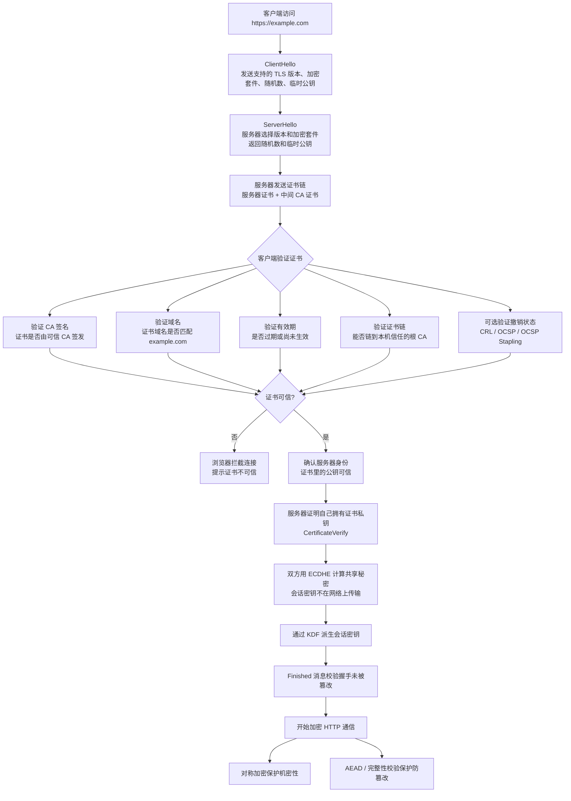
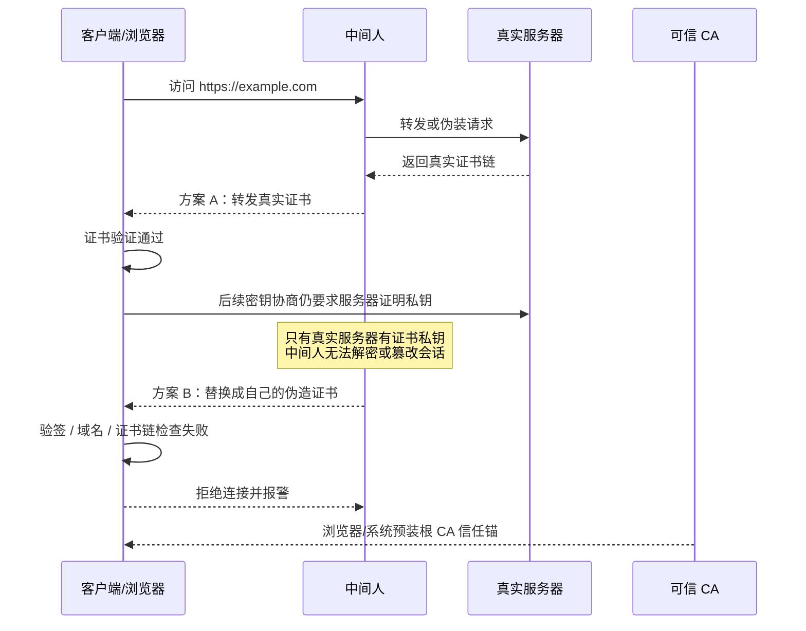
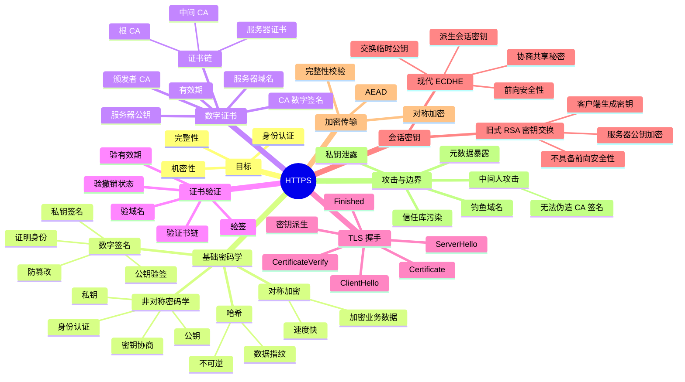

# HTTPS：证书、签名、密钥交换与加密通信


原文：这是我的理解，你看看对吗？如果有不对或者不恰当的地方一定要指出，如果对，有要补充的也补充：用公钥加密，私钥解密：可以保证数据只被拥有私钥的目标接收

用私钥加密，公钥解密：可以保证消息不被冒充，如果公钥正确解密，说明消息一定来自正确的发送方。
HTTPS 就是先用公钥和私钥进行的非对称加密交换对称加密密钥，然后通过对称加密方式进行数据传输的协议。
服务器有公钥和私钥，数据绝对不能用私钥加密传播，因为这样不仅不安全，而且由于非对称加密计算速度极其缓慢，所以数据只能用对称加密方式来传播，但是对称加密这个字符串需要借助非对称加密实现交换。
首先服务器将公钥和基本信息发给权威机构，权威机构用自己的私钥加密后生成数字证书，数字证书里面有服务器公钥和服务器信息和权威机构的电子签名，权威机构把数字证书的公钥放到了浏览器中，任何人都可以获得并解密数字证书。但是问题就在这，黑客用公钥解密后，获得了服务器的公钥，但是黑客没法形成正确的数字证书，因为他没有权威机构的私钥，所以他伪造的数字证书可以说一眼假。
客户端解密后，用 CA 证书的公钥解密获得了服务器的公钥（确认了缺失是来自权威机构，也就是来自正确的服务端），然后浏览器在本地随机生成一串极其复杂的字符串（对称会话密钥），用服务器的公钥加密，这样只有服务器可以解密，因为只有服务器有自己的私钥，私钥自始自终没有被传播。所以服务端拿到对称会话密钥之后，就可以把数据包用这个密钥加密，黑客因为没有对称会话密钥，没办法拿到数据包，只有客户端可以解密。后续所有数据传递，一旦交换对称会话密钥，都会以安全且极快的加密解密进行。直到 TCP 连接断开。

> HTTPS = HTTP + TLS。它解决的不是“把 HTTP 内容简单加密一下”，而是同时解决三件事：身份认证、机密性、完整性。

## 1. HTTPS 要解决什么问题

| 目标 | 要防什么 | TLS 怎么解决 |
| --- | --- | --- |
| 身份认证 | 你以为连的是银行，其实连到中间人 | 数字证书 + CA 信任链 |
| 机密性 | 数据被中间人窃听 | 对称加密传输业务数据 |
| 完整性 | 数据被中间人篡改 | 消息认证码 / AEAD |

一句话：

> HTTPS 先用 TLS 握手确认服务器身份，并协商出双方共享的会话密钥；后续 HTTP 数据再用这个会话密钥进行高效的对称加密传输。

## 2. 先分清：加密、签名、哈希

### 2.1 公钥加密，私钥解密

用途：保证只有拥有私钥的人才能解密。

```text
客户端用服务器公钥加密
        |
        v
只有服务器私钥能解密
```

这解决的是“机密性”。

### 2.2 私钥签名，公钥验签

原笔记里写“私钥加密，公钥解密”可以帮助初学者理解签名，但严格说不应叫加密，而应叫**数字签名**。

用途：证明消息确实由私钥持有者签出，并且内容没有被篡改。

```text
原文 -> 哈希 -> 摘要
摘要 -> 用私钥签名 -> 数字签名

验证时：
原文 -> 哈希 -> 摘要 A
数字签名 -> 用公钥验签 -> 摘要 B
比较 A 和 B
```

这解决的是“身份认证 + 完整性”。

### 2.3 哈希

哈希函数把任意长度数据压缩成固定长度摘要。它不是加密，因为不能从摘要还原原文。

用途：

- 生成数据指纹。
- 检测内容是否被篡改。
- 作为数字签名的输入。

## 3. 数字证书到底是什么

服务器自己说“我是 example.com，这是我的公钥”，客户端不能直接相信。因为中间人也可以伪造一份“我是 example.com，这是我的公钥”。

所以需要 CA（Certificate Authority，证书颁发机构）给服务器公钥背书。

数字证书大致包含：

- 服务器域名，例如 `example.com`
- 服务器公钥
- 证书有效期
- 证书用途
- 颁发者 CA 信息
- CA 对证书内容生成的数字签名

更准确地说：

> 证书的主体信息通常是明文的，CA 不会把整张证书都用私钥加密。CA 会对证书核心内容做哈希，然后用自己的私钥签名。客户端用 CA 公钥验证签名。

## 4. 浏览器如何验证证书

客户端收到服务器证书后，会做几类检查：

1. **验证签名**  
   用本机信任库中的 CA 公钥验证证书上的数字签名。

2. **验证域名**  
   检查证书里的域名是否和当前访问的域名匹配。

3. **验证有效期**  
   检查证书是否过期或尚未生效。

4. **验证证书链**  
   服务器证书通常不是根 CA 直接签的，而是由中间 CA 签发。客户端要一路验证到受信任的根 CA。

5. **验证撤销状态**  
   证书可能还没过期但已经被吊销。客户端可能通过 CRL、OCSP、OCSP Stapling 等机制检查。

如果验证通过，客户端才相信：

> 这张证书里的服务器公钥确实属于当前访问的域名。

## 5. HTTPS 为什么不用非对称加密传输所有数据

非对称加密适合身份认证和密钥交换，但计算成本高，不适合加密大量业务数据。

所以 HTTPS 使用混合加密：

```text
握手阶段：非对称密码学 + 证书验证 + 密钥协商
传输阶段：对称加密保护 HTTP 数据
```

对称加密速度快，适合大规模数据传输。非对称密码学负责解决“如何安全地得到同一个会话密钥”。

## 6. 会话密钥是怎么来的

这里要分旧式理解和现代 TLS 理解。

### 6.1 旧式 RSA 密钥交换

早期 TLS 可以这样做：

```text
客户端生成随机会话密钥
客户端用服务器公钥加密会话密钥
服务器用自己的私钥解密
双方得到同一个会话密钥
```

这种解释适合入门，但不是现代 HTTPS 的主流方式。

问题是：如果服务器私钥未来泄露，攻击者可以解密过去抓到的握手数据，从而恢复历史会话密钥。这不具备前向安全性。

### 6.2 现代 TLS：ECDHE 密钥协商

现代 TLS，尤其 TLS 1.3，主流使用 ECDHE 协商会话密钥。

核心思想：

```text
客户端生成临时密钥对
服务器生成临时密钥对
双方交换临时公钥
各自用“自己的临时私钥 + 对方的临时公钥”计算出同一个共享秘密
再通过密钥派生函数生成会话密钥
```

关键点：

- 会话密钥不是直接在网络上传输的。
- 服务器证书中的公钥主要用来证明服务器身份。
- 临时密钥用于协商会话密钥。
- 即使服务器长期私钥未来泄露，过去的会话密钥通常也不能被恢复，这叫前向安全性。

## 7. TLS 握手简化流程

以现代 TLS 的思路简化理解：

```text
1. ClientHello
   客户端发送支持的 TLS 版本、加密套件、随机数、临时公钥等

2. ServerHello
   服务器选择 TLS 版本和加密套件，发送随机数、临时公钥等

3. Certificate
   服务器发送证书链，证明自己的身份

4. CertificateVerify / Finished
   服务器证明自己确实拥有证书对应的私钥，并完成握手校验

5. 密钥派生
   双方基于 ECDHE 共享秘密和随机数派生出会话密钥

6. 加密通信
   后续 HTTP 请求和响应都使用对称加密保护
```

## 8. 中间人攻击为什么会失败

中间人可以拦截流量，也可以替换服务器公钥，但它过不了证书验证。

如果中间人把自己的公钥塞给客户端：

```text
客户端访问 example.com
中间人返回“伪造证书 + 中间人公钥”
浏览器验证证书签名
发现没有可信 CA 背书，或域名不匹配
连接失败 / 报不安全
```

中间人真正困难的地方不是“看不到证书内容”，证书本来就是公开的；困难在于它无法伪造可信 CA 对目标域名证书的签名。

## 9. HTTPS 能保证什么，不能保证什么

HTTPS 能保证：

- 连接对象的身份经过证书验证。
- 传输内容不容易被窃听。
- 传输内容被篡改时能被发现。

HTTPS 不能保证：

- 服务端本身没有漏洞。
- 用户不会访问钓鱼域名。
- 浏览器或操作系统信任库没有被污染。
- 证书对应的私钥永远不会泄露。
- 加密后就没有元数据暴露；IP、端口、连接时间、流量大小等仍可能被观察。

## 10. 原笔记中需要修正的地方

1. **“私钥加密，公钥解密”不够严谨**  
   在签名场景里，更准确的说法是“私钥签名，公钥验签”。签名不是为了保密，而是为了证明身份和防篡改。

2. **“HTTPS 就是用公钥私钥交换对称密钥”只适合入门简化**  
   现代 TLS 通常不是直接用服务器公钥加密会话密钥，而是用 ECDHE 协商共享秘密，再派生会话密钥。

3. **“数字证书的公钥放到了浏览器中”说法不准**  
   浏览器或操作系统内置信任的是根 CA 证书/根 CA 公钥，不是每个网站证书的公钥。

4. **“任何人都可以解密数字证书”表述容易误导**  
   证书主体信息本来就是明文公开的，不需要“解密”。客户端需要做的是验签。

5. **“直到 TCP 连接断开”不完整**  
   会话密钥通常绑定到一次 TLS 会话或连接上下文。现代协议还可能有会话恢复、0-RTT、连接复用等机制，不能简单等同于 TCP 连接生命周期。

## 11. 一句话总结

HTTPS 的核心不是“服务器把公钥发给客户端”这么简单，而是：客户端通过 CA 信任链确认服务器公钥可信；双方通过 TLS 握手安全地协商出会话密钥；后续 HTTP 数据用对称加密和完整性校验保护。

## 12. HTTPS 握手流程图

这张图按“客户端想安全访问网站”这条主线展开，比单纯罗列概念更适合复习。



## 13. 中间人攻击为什么失败

从攻击者视角看，HTTPS 的关键防线不是“证书内容看不见”，而是“攻击者无法伪造可信 CA 对目标域名的签名”。



## 14. 复习总图


